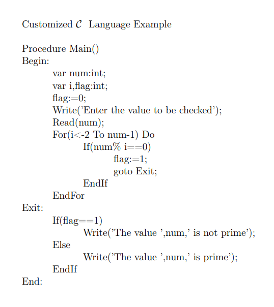
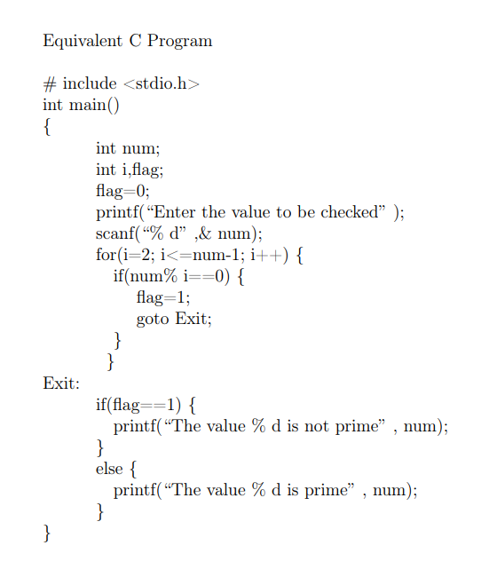

# Lex-Yacc-Translator
This is a translator that I made as part of my course-work for Compiler Construction. The problem statement describes a "Customized C" Language that needs to be translated to normal C code. The exact description of the problem statement is delineated in "problem_statement.pdf".

# Quick Start
Simply pipe your input file into the translator executable "c2c":


```bash
./c2c < sample_inputs/sample_input1.txt
```

# Compiling Lex And Yacc
If you choose to play around with the lex ("project.l") and yacc ("project.y") files, you would need to step through the following commands in the terminal to see your contributions / file changes in action. Make sure you've installed flex and bison on your system.

```bash
flex project.l
```
```bash
yacc -dv project.y
```

```bash
gcc -o c2c lex.yy.c y.tab.c -lfl
```

# Example Input and Output

  ## "Customized C" Language Input
  
  
  ## C Code Output
  
